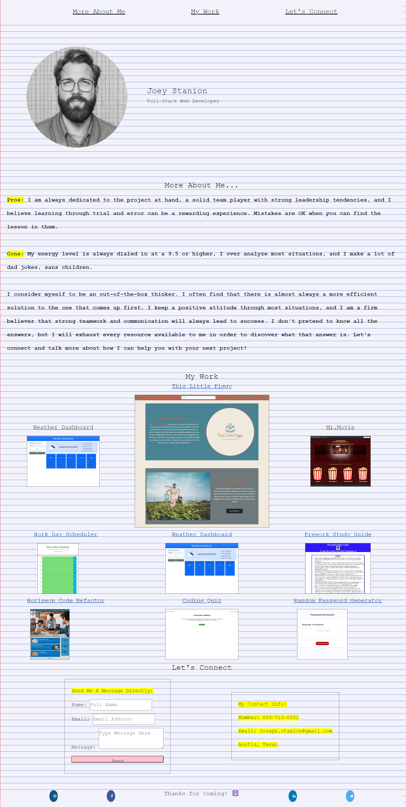

# My Portfolio - Joey Stanion

## Description

I created this portfolio in hopes for a quality "jumping-off" point in my career as a developer. As I learn new skills and techniques throughout this course, I will continue adding to this portfolio to showcase my strengths, experience, and work history. I have learned how to overcome challenges associated with grid layout and responsive web design.

## Screenshot of Web Application

## Credits

I used help from a tutorial on adding social media icons to CSS and HTML:
[https://www.w3schools.com/howto/howto_css_social_media_buttons.asp]

## License

Please refer to the license listed in the repo.

## Features

-Clicking a link in the navigation bar wil take you to that section of the browser automatically.

-Clicking on any project image will redirect you to the live deployment of that application on a new tab.

Note - The submission form does not yet send an email out (I haven't learned that function yet!). It is a work in progress.

## Link to Deployed Website

[https://jstanion.github.io/week2-portfolio/]
